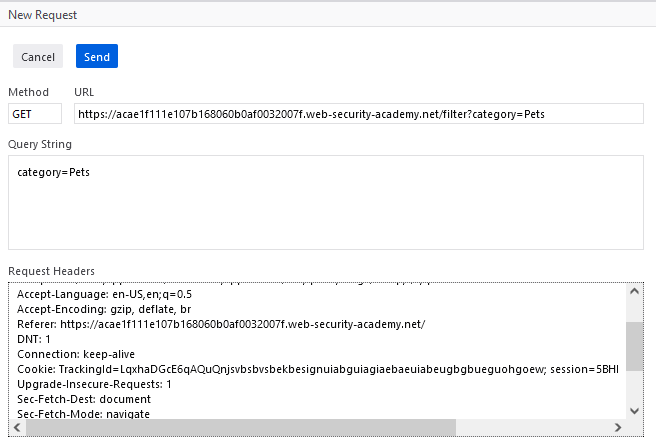

# General Notes
- Seeing if webpage loads differently with various boolean inputs
    - EX: ' AND '1'='1 (one always equals one)
    - EX: ' AND '1'='2 (always false)
- Example Situation: Figuring out password
    - ' AND SUBSTRING((SELECT Password FROM Users WHERE Username = 'Administrator'), 1, 1) > 'm
        - kinda doing a binary search to figure which letters are in password
    - ' AND SUBSTRING((SELECT Password FROM Users WHERE Username = 'Administrator'), 1, 1) =' s
        - testing exact letter instead of some range
    - How the command works: 
        - First '1' is the index
        - Second '1' is the number of chars after the index to be returned
        - INDEX STARTS AT ONE NOT ZERO
    - SUBSTRING -> SUBSTR for Oracle databases
    - Do these commands still use comments at end?

# Goal: Log in as Admin

# Useful Lab Notes
- Tracking cookie for analytics
- Cookies are checked in table to see if you are one of the tracked users
    - Get a "Welcome back!" message if query returns stuff
- Cannot do UNION attacks to get table/column info since query data is not obviously revealed to user
- They gives us info:
    - Table: users
    - Columns: username / password

# Preliminary Work
- Figure out which GET methods are useful for SQLi
    - Using the category=Pets endpoint
    - 
- IGNORE THIS ^
    - Manipulating the trackingID cookie so we are not using endpoint query manipulation
- How to edit the cookie?
    - Could not edit in Cookies Tab
    - When doing 'Edit and Resend', you can edit Cookies in Request Headers box
        - 

# Examining Conditional Responses
- 1=1 Cookie Entry
    - 
    - 
- Entering the conditional tests did not yield changes in "Welcome back!" message
    - Tried empty ("") trackingID cookie to no avail
- v After watching looking at Answers tab: 
    - Tried xyx' AND '1'='1 to no avail
- After watching one of the Answer videos:
    - Simpler test: Just add a few chars to existing cookie to see if anything changes
        - 
        - JK, it still did not work lol

 ## *** Postponed until I figure out how to get the responses to change *** ##
